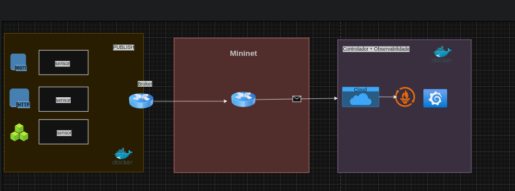

<h1 align="center"> IoT-DockerCity Project</h1>

<p align="center">
Simulação e monitoramento de redes IoT heterogêneas em um ambiente de Smart City usando Mininet, Docker, Prometheus e Grafana.
</p>

---

<p align="center">
<a href="#"></a>
<a href="#"></a>
<a href="#"></a>
<a href="#"></a>
<a href="#"></a>
</p>

---

## 📖 Overview

**IoT-DockerCity** permite modelar, emular e monitorar redes IoT heterogêneas em uma Smart City.

* Coleta de métricas de dispositivos IoT em tempo real.
* Visualização em dashboards interativos via Grafana.
* Emulação de condições de rede realistas usando Mininet + NetEm.

---

## 🏗️ Arquitetura



* **Dispositivos IoT:** modelados como contêineres Docker com capacidades variadas.
* **Controlador Central:** coleta métricas e dados dos dispositivos.
* **Monitoramento:** Prometheus coleta métricas; Grafana exibe dashboards.

---

## 🛠️ Technologies Used

<div style="display: inline-block">
    
    
    
    
    
</div>

## ⚡ Features

1. **IoT Device Modeling**

   * Configuração de CPU, RAM, armazenamento e interfaces de rede.
   * Aplicações com frequência de coleta, volume de dados e requisitos de latência.

2. **Network Emulation**

   * Topologias Mininet simulando latência, jitter e perda de pacotes.
   * Protocolo MQTT

3. **Centralized Monitoring**

   * Prometheus para coleta de métricas detalhadas.
   * Dashboards Grafana com alertas de sobrecarga ou falha.

4. **Containerized Environment**

   * Dispositivos e serviços isolados para escalabilidade e replicação.

---

## 🚀 Instalação e Execução

### Pré-requisitos
Certifique-se de ter os seguintes programas instalados:

- Docker e Docker Compose: Para a orquestração dos contêineres.
- Python 3: Para rodar o script do Mininet.
- Mininet: A biblioteca para a emulação de rede.
- Figlet: O programa para exibir o nome do script em arte ASCII.

### Passo a passo

**Clone o repositório**:

```bash

git clone [https://github.com/Julio-Caio/iot-dockercity.git](https://github.com/seurepositorio/iot-dockercity.git)

cd IoT-Dockercity
```

Dê permissão de execução ao script run.sh:
```bash
   chmod +x run.sh
```

### Execute o script principal:

Use a opção -a ou --all para iniciar todos os componentes da simulação. O script deve ser executado com permissões de root.

```bash
   sudo ./run.sh -a
```

## Opções do Script

<table border="1">
  <tr>
    <th>Opção</th>
    <th>Descrição</th>
  </tr>
  <tr>
    <td>-h ou --help</td>
    <td>Exibe este menu de ajuda.</td>
  </tr>
  <tr>
    <td>-V ou --version</td>
    <td>Exibe a versão do script.</td>
  </tr>
  <tr>
    <td>-a ou --all</td>
    <td>Executa todas as funções.</td>
  </tr>
  <tr>
    <td>-m ou --monit</td>
    <td>Sobe contêineres de monitoramento (Prometheus e Grafana).</td>
  </tr>
  <tr>
    <td>-d ou --devices</td>
    <td>Sobe contêineres dos dispositivos emulados.</td>
  </tr>
  <tr>
    <td>-c ou --create</td>
    <td>Cria as rotas de rede dentro dos contêineres.</td>
  </tr>
  <tr>
    <td>-i ou --infra</td>
    <td>Levanta a rede do Mininet.</td>
  </tr>
  <tr>
    <td>-cl ou --clean</td>
    <td>Remove todas as imagens Docker.</td>
  </tr>
</table>


### 4. Acessar dashboards

Para alcançar a interface gráfica, configurar e visualizar as dashboards, execute:

```bash
docker network create -d macvlan   --subnet=<RedeLocal>  --gateway=<GatewayLocal>   -o parent={interface física de rede}   macvlan-net
```

#### Após isso, conecte esta rede **macvlan-net** ao Prometheus e Grafana:

```bash
docker network connect macvlan-net prometheus
docker network connect macvlan-net grafana
```

```bash
docker inspect prometheus | grep "IPAddress"
docker inspect grafana | grep "IPAddress"
```

* Prometheus: http://{IP-MAC-VLAN-PROMETHEUS}:9090
* Grafana: http://{IP-MAC-VLAN-GRAFANA}:3000

---

## 🧑‍💻 Authors

<a href="https://github.com/Julio-Caio"><b>Júlio Caio</b></a><br>
<a href="https://github.com/JuliaSantss"><b>Júlia Beatriz</b></a>